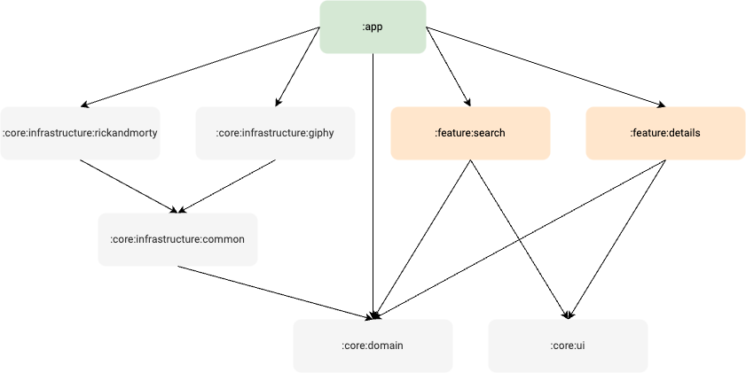

# RLAD - Random List And Details

RLAD is an Android application that follows development best practices and is used as a playground
to try out new patterns and libraries in the Android world.

The app uses a few public APIs to display lists of items and their details.

RLAD is available on [Google Play](https://play.google.com/store/apps/details?id=com.rlad).

## Technologies

* Kotlin
* Coroutines
* Compose
* Hilt
* Room
* Retrofit
* Paging
* Coil
* Unit testing
* UI testing
* Other various Jetpack libraries
* Modularization
* Github Actions
* ...

## APIs

* [Giphy](https://developers.giphy.com/docs/api/endpoint)
* [Rick And Morty](https://rickandmortyapi.com/documentation)

## Development setup

1. Clone the repository
2. Generate Giphy API key on [developers.giphy.com](https://developers.giphy.com)
3. Set the key in `~/.gradle/gradle.properties` as `GIPHY_API_KEY=ThisIsYourKey`
4. Build the project

## Modularization

App is split into feature and core modules. Feature modules correspond to the UI features that
are visible to the user. Core modules are building blocks used by feature modules.

Feature modules:

* Search
* Details

Core modules:

* Domain: UI models, use cases, navigator, etc
* Infrastructure: usage of external APIs
* UI: shared components used in UI
